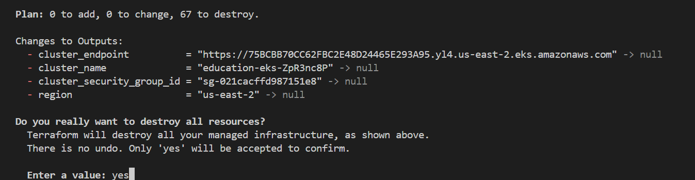

# Provision an EKS cluster (AWS)
AWS's Elastic Kubernetes Service (EKS) is a managed service that lets you deploy, manage, and scale containerized applications on Kubernetes.

## Prerequisites
You will need:

- `Terraform v1.3+` installed locally.
- an [AWS account](https://portal.aws.amazon.com/billing/signup?nc2=h_ct&src=default&redirect_url=https%3A%2F%2Faws.amazon.com%2Fregistration-confirmation#/start)
- the AWS CLI v2.7.0/v1.24.0 or newer, [installed](https://docs.aws.amazon.com/cli/latest/userguide/getting-started-install.html) and [configured](https://docs.aws.amazon.com/cli/latest/userguide/getting-started-install.html)
- [AWS IAM Authenticator](https://docs.aws.amazon.com/cli/latest/userguide/getting-started-install.html)
- [kubectl](https://docs.aws.amazon.com/cli/latest/userguide/getting-started-install.html) v1.24.0 or newer

Configure kubectl
After provisioning your cluster, you need to configure kubectl to interact with it.

First, open the outputs.tf file to review the output values. You will use the region and cluster_name outputs to configure kubectl.

### AWS VPC


The configuration defines a new VPC in which to provision the cluster, and uses the public EKS module to create the required resources, including Auto Scaling Groups, security groups, and IAM Roles and Policies.

Open the `main.tf` file to review the module configuration. The eks_managed_node_groups parameter configures the cluster with three nodes across two node groups.


### Provision the EKS cluster
Run terraform apply to create your cluster and other necessary resources. Confirm the operation with a yes.

This process can take up to 10 minutes. Upon completion, Terraform will print your configuration's outputs.


### Configure kubectl
After provisioning your cluster, you need to configure `kubectl` to interact with it.

First, open the [outputs.tf](outputs.tf) file to review the output values. You will use the region and cluster_name outputs to configure `kubectl`.

Run the following command to retrieve the access credentials for your cluster and configure kubectl.

```
aws eks --region $(terraform output -raw region) update-kubeconfig \
    --name $(terraform output -raw cluster_name)
```

### Verify the Cluster
Use `kubectl` commands to verify your cluster configuration.

First, get information about the cluster.


Notice that the Kubernetes control plane location matches the cluster_endpoint value from the terraform apply output above.

Now verify that all three worker nodes are part of the cluster.

```
kubectl get nodes
```


### Clean up your workspace
You have now provisioned an EKS cluster, configured `kubectl`, and verified that your cluster is ready to use.

Destroy the resources you created in this tutorial to avoid incurring extra charges. Respond yes to the prompt to confirm the operation.

